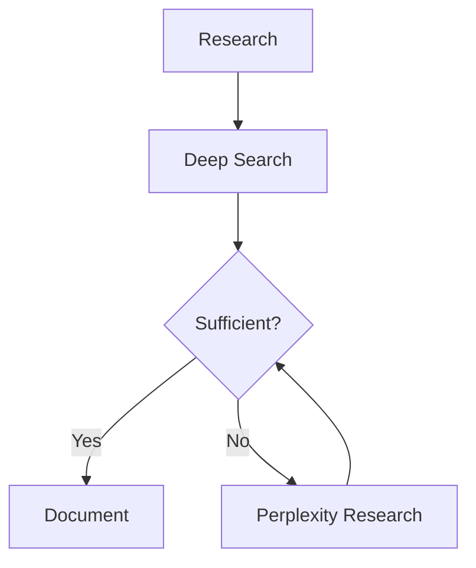

# Knowledge Base Writing Guide

## Voice and Tone

The knowledge base uses an **encyclopedic reference** voice:

- Third-person perspective throughout
- Present tense for current facts, past tense for historical events
- Active voice preferred over passive when it doesn't sacrifice neutrality
- Technical terms defined on first use with a brief parenthetical or footnote

## Paragraph Structure

Each paragraph should:

1. **Lead with the key claim or fact**
2. **Support with evidence or explanation** (1-3 sentences)
3. **Cite the source** inline using `[Title](URL)` or `[Author, Year](URL)`

Avoid single-sentence paragraphs unless used for emphasis or transition. Avoid paragraphs longer than 6-7 sentences.

## Heading Hierarchy

- `#` — Document title (one per file)
- `##` — Major sections
- `###` — Subsections within a major section
- `####` — Rarely needed; consider whether the content should be a separate file instead

Never skip heading levels (e.g., `#` directly to `###`).

## Citation Formatting

### Inline Citations

For specific claims, statistics, or quotes:

```markdown
The global quantum computing market is projected to reach $65 billion by 2030
[McKinsey Quantum Technology Report](https://example.com/mckinsey-quantum-2025).
```

### Grouped Citations

When multiple sources support a single claim:

```markdown
Several studies have confirmed this effect
([Smith et al., 2024](https://example.com/smith);
[Chen & Park, 2025](https://example.com/chen);
[European Commission Report](https://example.com/ec-report)).
```

### Disputed Claims

When sources disagree:

```markdown
Estimates vary significantly: [Source A](url) reports 15%, while
[Source B](url) places the figure closer to 8%. The discrepancy may stem
from differing methodologies — Source A uses self-reported surveys while
Source B relies on observational data.
```

## Handling Incomplete Information

Be explicit rather than silent:

- "No peer-reviewed studies were found on this specific aspect as of {date}."
- "This figure is widely cited but the primary source could not be located."
- "The most recent data available dates to {year}; more current figures may exist."

## Lists and Tables

Use **bulleted lists** for items without inherent order.
Use **numbered lists** for sequential steps or ranked items.
Use **tables** for structured comparisons with 3+ attributes.

## Code Blocks and Technical Content

Use fenced code blocks with language identifiers for any technical content:

````markdown
```python
example_code = "always specify the language"
```
````

## Length Guidelines

- **`intro.md`**: 800-2500 words depending on topic complexity
- **Subtopic files**: 500-2000 words
- **`sources.md`**: No length limit — include every source
- **Individual sections**: 100-500 words; split if longer

## Images and Diagrams

The knowledge base is text-only. Do not reference external images. If a diagram would aid understanding, describe it textually or use ASCII/Mermaid diagram syntax:

````markdown

````
